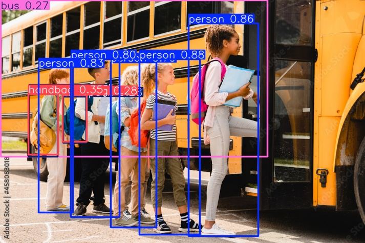

# 🚗 Vehicle Tracking & Direction-Based Traffic Counting using YOLOv8

## 📸 Sample Detection Output (Image Inference)
Below is a sample output generated by running the model on a **static test image** to validate object detection performance before applying it to video-based tracking.

The image demonstrates:
- Detected objects highlighted using bounding boxes  
- Predicted class labels with confidence scores  
- Model validation on still images prior to real-time video processing  

---

## 🎥 Project Demo (Video Inference)
Click the thumbnail below to watch the full project demonstration on YouTube, showcasing **vehicle tracking and direction-based counting on video input**:

---

## 📖 Overview
This project implements an **intelligent traffic analysis system** using **computer vision and deep learning** to detect, track, and count vehicles in a video stream.

By combining **real-time object detection** with **multi-object tracking**, each vehicle is assigned a persistent unique ID. Vehicles are counted based on their movement direction as they cross a predefined virtual region on the roadway, enabling accurate **incoming and outgoing traffic analysis**.

This project demonstrates a real-world application of AI in **traffic monitoring, smart cities, and transportation analytics**.

---

## 🎯 Project Objectives
- Detect vehicles accurately in images and video streams  
- Track multiple vehicles simultaneously with persistent identities  
- Analyze vehicle movement direction  
- Count vehicles based on directional flow  
- Display real-time detection and counting results  

---

## 🧠 System Workflow
1. Model inference is first validated on static images  
2. Video input is processed frame by frame  
3. Vehicles are detected using a YOLOv8-based deep learning model  
4. Each detected vehicle is assigned a unique tracking ID  
5. A virtual reference line (Region of Interest) is defined  
6. Vehicle movement across the region is analyzed  
7. Vehicles are counted as **Coming In** or **Going Out**  
8. Results are rendered directly on the output video  

---

## ✨ Key Features
- 🚘 Real-time vehicle detection  
- 🔄 Multi-object tracking with unique IDs  
- ↕️ Direction-based vehicle counting  
- 📊 Live incoming and outgoing counters  
- 🖥️ Visual overlays with bounding boxes, labels, and IDs  
- ⚙️ Scalable for real-world traffic surveillance  

---

## 🧩 Applications
- Traffic flow monitoring  
- Smart city infrastructure  
- Highway and toll booth surveillance  
- Transportation analytics  
- Intelligent traffic management systems  

---

## 🛠️ Skills & Technologies
- Computer Vision  
- Object Detection  
- Multi-Object Tracking  
- YOLOv8  
- Deep Learning  
- Video Analytics  
- OpenCV  
- Python  
- Traffic Flow Analysis  

---

## 🚀 Future Improvements
- Vehicle type classification (car, bus, truck, bike)  
- Speed estimation for each vehicle  
- Lane-wise traffic analysis  
- Integration with live CCTV streams  
- Exporting traffic data for dashboards and reports  

---

## 📌 Conclusion
This project showcases the practical application of **AI-driven computer vision** to solve real-world transportation problems. By integrating detection, tracking, and directional analysis, the system provides an efficient and scalable solution for traffic monitoring.

---

⭐ If you find this project useful, feel free to star the repository!
